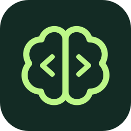

# VibeWise

**You build. AI writes.**

Cursor Agent Skills that put learning first and keep you in control while AI writes the code you designed. The agent **asks for your approach first**, helps you examine tradeoffs, and explains unfamiliar concepts. You shape the design and decide when it's ready to implement. The agent writes the code, then explains what it changed and why.

Tuned for **Azure**, **Entra ID**, **Bicep**, and **Python** Microsoft SDK automation (`azure-identity`, `azure-mgmt-*`, `msgraph-sdk`), with Microsoft Learn MCP wired into teaching when available.

For anyone who wants to learn as they build—whether you're an aspiring engineer, a junior developer, or an experienced engineer exploring an unfamiliar stack. Practice planning how the pieces fit together, anticipating failures, and checking the result while keeping ownership of the decisions.

Based on the upstream [nykooi1/vibe-wise](https://github.com/nykooi1/vibe-wise) Claude Code plugin (MIT).

## Get started

You need [Cursor](https://cursor.com) and [Python 3](https://www.python.org/downloads/).
VibeWise uses Python to reset learning notes and (optionally) restore context via a
Cursor plugin hook. No extra Python packages are needed.

### Install skills (recommended)

```sh
npx skills add broberts23/vibe-wise
```

This installs the Learn and Reset skills into `.agents/skills/` / `.cursor/skills/`
(project) or the matching user directories when you choose a global install.

In Cursor Agent chat, run:

```text
/vibe-wise-learn
```

Setup asks one question at a time with numbered choices. Pick **Use defaults** to
skip preference setup. Then ask the agent to build something. Starting fresh or
joining an unfamiliar repository both work. For an existing repository, the agent
first inspects the code and sketches a small system map.

Skills-only installs do not auto-restore on every new chat. Run `/vibe-wise-learn`
again to resume from `.vibe-wise/`.

### Optional: Cursor Plugin (auto-restore + Learn MCP)

For session restore on chat start and automatic Microsoft Learn MCP wiring, install
this repository as a Cursor Plugin (see [Cursor plugins](https://cursor.com/docs/reference/plugins)).
The plugin packages the same skills, a `sessionStart` hook, and root `mcp.json`.

### Microsoft Learn MCP (skills-only)

If you stay on skills-only install, add Learn MCP in Cursor settings / `mcp.json`:

```json
{
  "mcpServers": {
    "microsoft-learn": {
      "url": "https://learn.microsoft.com/api/mcp"
    }
  }
}
```

No authentication is required. When available, Learn mode uses
`microsoft_docs_search`, `microsoft_docs_fetch`, and `microsoft_code_sample_search`
before teaching Microsoft facts or proposing samples.

## What it feels like

You're building a Notion-style notes app: users sign in, create and edit private
notes, and organize them into folders. Here, you're working through how notes and
folders relate—and what should happen when someone deletes a folder.

This condensed example is adapted from a real learning session. Later implementation
steps are illustrative; intervening design discussions are omitted.

**You:**

```text
A note can be in several folders. Deleting a folder should delete its notes.
```

**Agent:**

```text
✦ Build checkpoint: Deleting a shared note

"Trip ideas" is in both Travel and Summer. Deleting it removes it from both.

When someone deletes Travel, what should happen to that note in Summer?
```

**You:**

```text
Keep it in Summer. If it has no folders left, keep the note outside any folder.
```

**Agent:**

```text
That separates deleting a folder from deleting a note.

✦ Build checkpoint: Connecting notes and folders

How would you represent which folders a note belongs to, without copying the note?
```

**You:**

```text
A links table with note_id and folder_id. Deleting a folder removes its links,
not the notes.
```

**Agent:**

```text
Each link records one membership. Several links can point to the same note;
a note with no links is unfiled.

notes ← folder links → folders

✦ Design checkpoint: Folder membership

Proposed: store notes once and track folder membership in a links table.
Deleting a folder removes its links and keeps the notes. This supports multiple
folders per note; loading a folder's notes needs a lookup through those links.

Confirming records this design. We still need to work through access rules
and technology choices before writing code.

1. Confirm and continue
   This approach makes sense to me; move to the next piece.
2. Discuss
   Ask questions or clarify anything that doesn't make sense before deciding.
```

**You:**

```text
1
```

*Later, after the remaining choices for this step are worked through...*

**Agent:**

```text
✦ Implementation checkpoint: Folder membership

I'll add the agreed tables and folder-deletion operation, then test that deleting
a folder preserves its notes and their membership in other folders.
This step builds storage behavior; the UI comes later.

1. Implement this step
   This approach makes sense to me; write the code for this step.
2. Discuss
   Ask questions or clarify anything that doesn't make sense before deciding.
```

**You:**

```text
1
```

*The agent writes the code and runs the tests.*

**Agent:**

```text
✦ Implementation report: Folder membership

- Added the schema migration: each membership references one note and one folder.
- Added folder deletion: removes the folder and its links, preserving note content.
- Added and ran tests for shared notes and notes left without a folder; both passed.
```

You don't need to know the answer already. The agent can explain unfamiliar concepts, sketch the relevant pieces, and help you tackle a smaller question. You stay involved in forming the plan. Answer in plain English; ask for more help or say “skip” whenever you want.

Describing what you want sets the requirements. Build Checkpoints ask you to work
out how it should function; a feature preference doesn't approve an architecture.

| Checkpoint | What happens |
| --- | --- |
| **Build** | You reason through how to approach the problem with the agent. |
| **Design** | Review the design. **Confirm and continue** records it and continues planning; no code yet. |
| **Implementation** | Review the specific code changes. **Implement this step** authorizes the agent to make them. |

These aren't three mandatory stops. When ready to code, the Implementation
checkpoint also confirms the design, skipping a separate Design checkpoint.
Both confirmations offer **Discuss** to ask questions, clarify anything confusing,
or explore alternatives before deciding.

When the agent proposes additional implementation details, it separates them from your
decisions in a short list or table explaining each addition and why it matters.
You can question or change any item before proceeding.

After implementation, the agent briefly explains what changed, how the key code works,
why it fits your decision, any tests it added or updated and what they cover, and
which checks ran with their results. Ask to dig deeper anywhere it's unclear.

Small diagrams help you trace data, understand relationships, and see how the system fits together.

## Make it yours

Experience changes the support you get, not your ownership of decisions:

| Level | Teaching approach |
| --- | --- |
| Beginner | Explain unfamiliar pieces, use diagrams, ask smaller reasoning questions. |
| Intermediate | Less introductory context; explore interactions and tradeoffs. |
| Advanced | Probe difficult constraints, failure modes, and design assumptions. |

Everyone reasons first. The agent adapts to what you demonstrate and how familiar you
are with the stack. Checkpoint frequency—Light, Normal, or Frequent—is separate.

- “Use fewer checkpoints.”
- “Focus on Entra app permissions.”
- “Use multiple-choice questions.”
- “Just implement this one.”
- “Pause learning.” Resume with `/vibe-wise-learn`.

Preferences, learning notes, and a project map live in `.vibe-wise/` in your project.
Add `.vibe-wise/` to your `.gitignore` to keep your notes out of Git; the skills won't
change it silently.

No extra account, backend, or telemetry. Saved notes are included in the agent's
context under your normal Cursor data settings.

To start learning this project from scratch, run `/vibe-wise-reset`. It shows the
project and asks **Cancel / Reset learning**. After confirmation, it backs up your
profile, progress, and project map inside the notes directory's `backups/` folder,
then restarts onboarding. Source code and other projects stay untouched. To change
your experience level or preferences, just tell the agent; no reset is needed.

## Updating

```sh
npx skills update
```

Or re-run `npx skills add broberts23/vibe-wise`. Your project learning notes
stay intact; no reset is needed.

## License

[MIT](LICENSE). Derived from [nykooi1/vibe-wise](https://github.com/nykooi1/vibe-wise)
by Noah Kim. You can use, modify, and share this software, including commercially.
Keep the license notice with copies. The software comes without a warranty.
