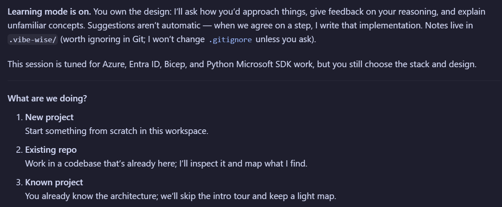
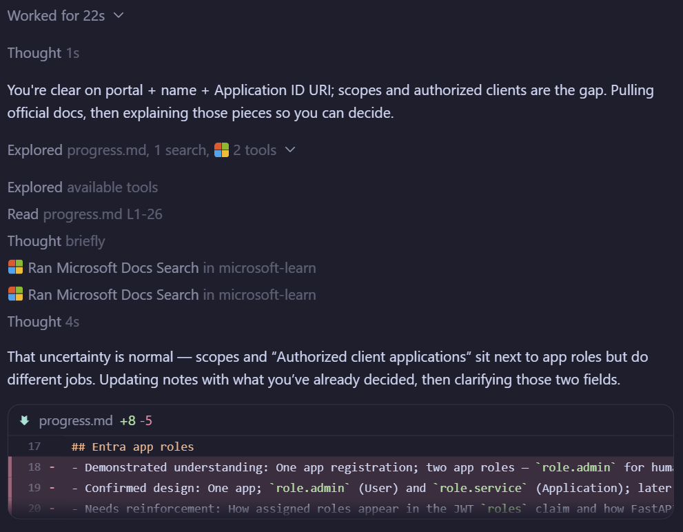

# VibeWise

**You build. AI writes.**

Cursor Agent Skills that put learning first and keep you in control while AI writes the code you designed. The agent **asks for your approach first**, helps you examine tradeoffs, and explains unfamiliar concepts. You shape the design and decide when it's ready to implement. The agent writes the code, then explains what it changed and why.

Tuned for **Azure**, **Entra ID**, **Bicep**, and **Python** Microsoft SDK automation (`azure-identity`, `azure-mgmt-*`, `msgraph-sdk`), with Microsoft Learn MCP wired into teaching when available.

For anyone who wants to learn as they build—whether you're an aspiring engineer, a junior developer, or an experienced engineer exploring an unfamiliar stack. Practice planning how the pieces fit together, anticipating failures, and checking the result while keeping ownership of the decisions.

Based on the upstream [nykooi1/vibe-wise](https://github.com/nykooi1/vibe-wise) Claude Code plugin (MIT).

## Get started

You need [Cursor](https://cursor.com) and [Python 3](https://www.python.org/downloads/).
VibeWise uses Python to reset learning notes and (optionally) restore context via a
Cursor plugin hook. No extra Python packages are needed.

### Install skills (recommended)

```sh
npx skills add broberts23/vibe-wise
```

This installs the Learn and Reset skills into `.agents/skills/` / `.cursor/skills/`
(project) or the matching user directories when you choose a global install.

In Cursor Agent chat, run:

```text
/vibe-wise-learn
```

Setup asks one question at a time with numbered choices. Pick **Use defaults** to
skip preference setup. Then ask the agent to build something. Starting fresh or
joining an unfamiliar repository both work. For an existing repository, the agent
first inspects the code and sketches a small system map.

Skills-only installs do not auto-restore on every new chat. Run `/vibe-wise-learn`
again to resume from `.vibe-wise/`.

### Optional: Cursor Plugin (auto-restore + Learn MCP)

For session restore on chat start and automatic Microsoft Learn MCP wiring, install
this repository as a Cursor Plugin (see [Cursor plugins](https://cursor.com/docs/reference/plugins)).
The plugin packages the same skills, a `sessionStart` hook, and root `mcp.json`.

### Microsoft Learn MCP (skills-only)

If you stay on skills-only install, add Learn MCP in Cursor settings / `mcp.json`:

```json
{
  "mcpServers": {
    "microsoft-learn": {
      "url": "https://learn.microsoft.com/api/mcp"
    }
  }
}
```

No authentication is required. When available, Learn mode uses
`microsoft_docs_search`, `microsoft_docs_fetch`, and `microsoft_code_sample_search`
before teaching Microsoft facts or proposing samples.

## What it feels like

You're building a FastAPI app on Azure Container Apps with Cosmos DB behind it:
Entra app roles separate human Swagger access from machine API callers, browser
sign-in for `/docs`, and keyless RBAC between services later. Local testing first.

This condensed example is adapted from a real learning session. Intervening
design discussions are omitted; the wording is illustrative.

After `/vibe-wise-learn`, Learning mode turns on: you own the design, the agent
asks how you'd approach things, and it writes code only when you agree. Sessions
are tuned for Azure, Entra ID, Bicep, and Python Microsoft SDK work—you still
choose the stack. Onboarding uses numbered choices (*New project* / *Existing
repo* / *Known project*), then experience and preferences.

**You:**

```text
one app. two roles. role.admin for human swagger access,
role.service for machine direct api access.
```

**Agent:**

```text
One app with two roles is a clean fit: the API is the single resource, and the
roles claim separates who may use Swagger as a human vs who may call the API
as a machine.

✦ Concept: App roles vs who can hold them

In Entra, each app role has allowedMemberTypes. User roles are assignable to
people (or groups); Application roles are assignable to other apps / managed
identities for client-credentials. Your role.admin / role.service split usually
maps to User vs Application so a daemon cannot get the human Swagger role by
accident.

✦ Design checkpoint: One app, two roles

Your decisions
- One app registration
- role.admin — human Swagger access
- role.service — machine direct API access

1. Confirm and continue
2. Discuss
```

**You:**

```text
1
```

*Later, creating the app registration in the portal…*

**You:**

```text
I'll create the app in the Entra portal. Name: project-fastapi-swagger.
Application ID URI: api://{appId}.
I don't know what the scopes and Authorized client applications will be.
```

**Agent:**

```text
You're clear on portal + name + Application ID URI; scopes and authorized
clients are the gap. Pulling official docs, then explaining those pieces so
you can decide.
```

*The agent searches Microsoft Learn (`microsoft_docs_search`) and updates
`.vibe-wise/progress.md` before teaching—grounding Microsoft facts in Learn,
not guessing.*

**Agent:**

```text
That uncertainty is normal — scopes and “Authorized client applications” sit
next to app roles but do different jobs.

✦ Concept: Scopes vs app roles

Scopes (Expose an API) are delegated permissions. They show up in the token’s
scp claim when a signed-in user’s client asks for access. App roles are what
you already chose: they show up in the roles claim. Machines using client
credentials get application roles; humans get user roles when assigned.

So for your design: roles do the real authorization; a scope is mainly the
“ticket into a user access token” for Swagger’s browser flow.

✦ Why this matters

If you skip a delegated scope, Swagger’s user login may fail to get a usable
access token for your API even though role.admin exists. If you over-build
scopes that mirror every operation, you’ll maintain two permission models
(scp and roles) when you already decided roles are the splitter.

✦ Build checkpoint: Scopes and authorized clients

For this one-app portal setup, what do you want for:
1. Scope(s) under Expose an API, and
2. Authorized client applications (empty, same app’s client ID, or other)?

Say it in your own words; ask for options if you want concrete proposals.
```

You reason first. Numbered confirmations come after you've stated an approach—
or when the agent offers a short menu so you can pick without inventing the
whole answer. You don't need to know the answer already: ask for more help or
say “skip” whenever you want.

<p align="center">
  
  <br>
  
</p>

Describing what you want sets the requirements. Build Checkpoints ask you to work
out how it should function; a feature preference doesn't approve an architecture.

| Checkpoint | What happens |
| --- | --- |
| **Build** | You reason through how to approach the problem with the agent. |
| **Design** | Review the design. **Confirm and continue** records it and continues planning; no code yet. |
| **Implementation** | Review the specific code changes. **Implement this step** authorizes the agent to make them. |

These aren't three mandatory stops. When ready to code, the Implementation
checkpoint also confirms the design, skipping a separate Design checkpoint.
Both confirmations offer **Discuss** to ask questions, clarify anything confusing,
or explore alternatives before deciding.

When the agent proposes additional implementation details, it separates them from your
decisions in a short list or table explaining each addition and why it matters.
You can question or change any item before proceeding.

After implementation, the agent briefly explains what changed, how the key code works,
why it fits your decision, any tests it added or updated and what they cover, and
which checks ran with their results. Ask to dig deeper anywhere it's unclear.

When Microsoft facts are involved, Learn mode prefers `microsoft_docs_search`,
`microsoft_docs_fetch`, and `microsoft_code_sample_search` before teaching or
proposing samples. Small diagrams help you trace data, understand relationships,
and see how the system fits together.

## Make it yours

Experience changes the support you get, not your ownership of decisions:

| Level | Teaching approach |
| --- | --- |
| Beginner | Explain unfamiliar pieces, use diagrams, ask smaller reasoning questions. |
| Intermediate | Less introductory context; explore interactions and tradeoffs. |
| Advanced | Probe difficult constraints, failure modes, and design assumptions. |

Everyone reasons first. The agent adapts to what you demonstrate and how familiar you
are with the stack. Checkpoint frequency—Light, Normal, or Frequent—is separate.

- “Use fewer checkpoints.”
- “Focus on Entra app permissions.”
- “Use multiple-choice questions.”
- “Just implement this one.”
- “Pause learning.” Resume with `/vibe-wise-learn`.

Preferences, learning notes, and a project map live in `.vibe-wise/` in your project.
Add `.vibe-wise/` to your `.gitignore` to keep your notes out of Git; the skills won't
change it silently.

No extra account, backend, or telemetry. Saved notes are included in the agent's
context under your normal Cursor data settings.

To start learning this project from scratch, run `/vibe-wise-reset`. It shows the
project and asks **Cancel / Reset learning**. After confirmation, it backs up your
profile, progress, and project map inside the notes directory's `backups/` folder,
then restarts onboarding. Source code and other projects stay untouched. To change
your experience level or preferences, just tell the agent; no reset is needed.

## Updating

```sh
npx skills update
```

Or re-run `npx skills add broberts23/vibe-wise`. Your project learning notes
stay intact; no reset is needed.

## License

[MIT](LICENSE). Derived from [nykooi1/vibe-wise](https://github.com/nykooi1/vibe-wise)
by Noah Kim. You can use, modify, and share this software, including commercially.
Keep the license notice with copies. The software comes without a warranty.
